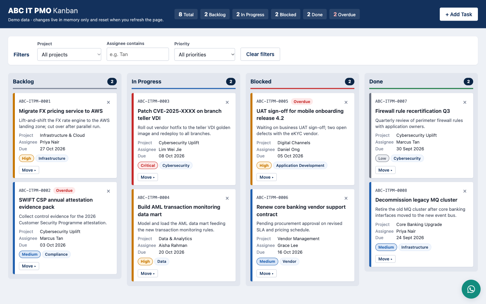
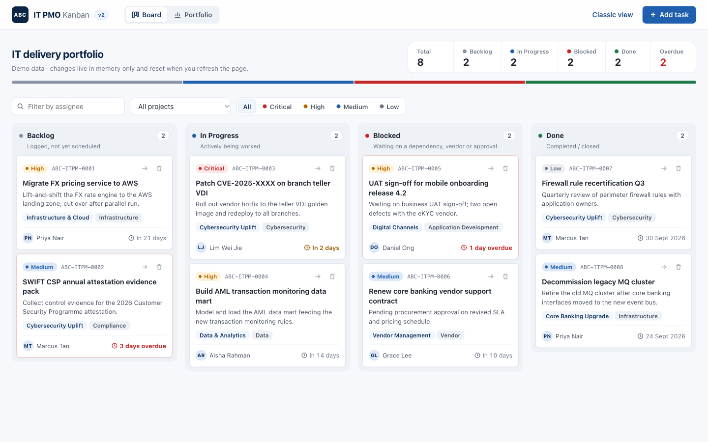
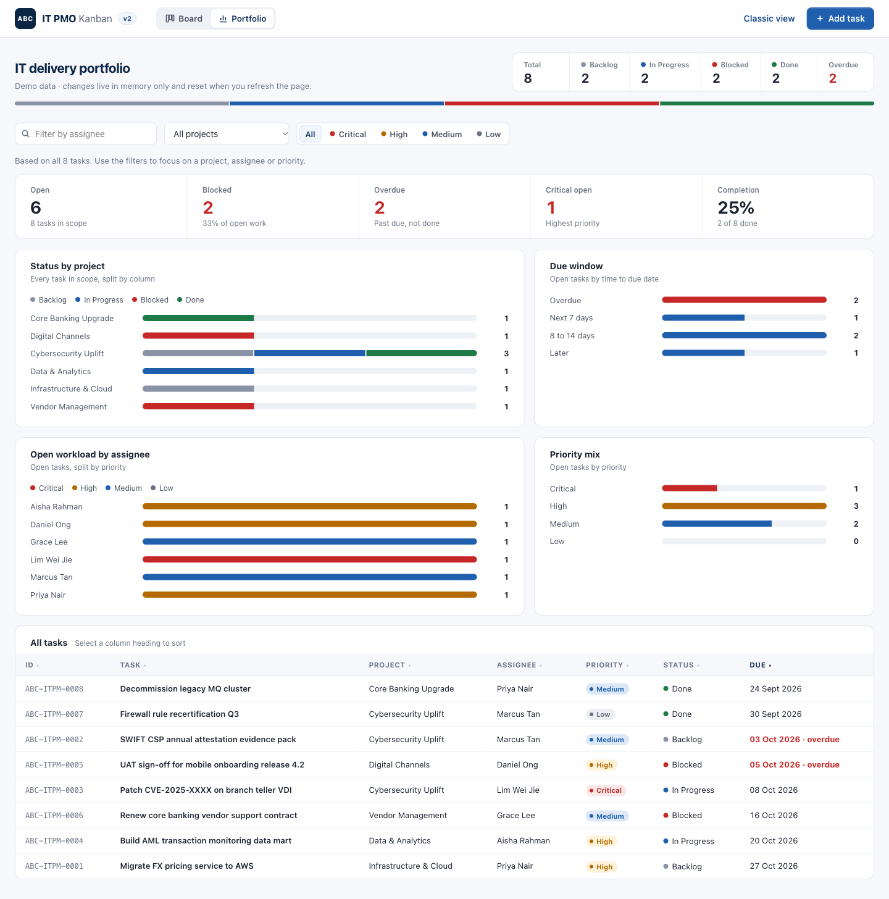

# claude-training-kanban

A demo IT PMO Kanban board for a fictitious bank, **"ABC IT PMO"**, built with vanilla HTML/CSS/JS. Each version is a single file.

**Live demo (v1):** https://rakeshgurumoorthi.github.io/claude-training-kanban/



**v2 redesign:** https://rakeshgurumoorthi.github.io/claude-training-kanban/v2/. It adds a modern layout, a Portfolio dashboard view (KPIs, status by project, workload, due window and a sortable task table) and priority filter chips. v1 stays at the root, unchanged.



The v2 **Portfolio** view turns the same tasks into a dashboard: headline figures, status by project, due window, open workload by assignee, priority mix and a sortable task table.



## Features

- **Four columns:** Backlog, In Progress, Blocked and Done, each with a live count badge.
- **Drag and drop** cards between columns. Each card also has a keyboard-friendly **Move** menu and an inline delete confirmation.
- **Filters** by project, assignee (text match) and priority, with a result count and a "Clear filters" button.
- **Summary strip** in the header showing total, per-status and overdue counts. It always counts every task, including any hidden by filters.
- **Add Task dialog** (native `<dialog>`) with inline validation. New tasks get IDs like `ABC-ITPM-0001`.
- **Email notification** of new tasks through [FormSubmit](https://formsubmit.co/). The card is added straight away, and if the email fails you only see a warning toast.
- **Briefing notice:** after 10 seconds on the page, a popup announces the IT Project Briefing (Wednesday 7 October 2026, 2:00 PM, Town Hall Meeting Room). It stops appearing once the briefing starts. A Claude Code `SessionStart` hook in [`.claude/hooks/`](.claude/hooks/) shows the same reminder to anyone working on the project in Claude Code.
- **WhatsApp chat widget:** a floating button at the bottom right opens a list of suggested IT project questions. Picking one opens WhatsApp in a new tab with that question ready to send. The questions are fixed text, never board data, and the number is a dummy (`WHATSAPP_NUMBER`) to replace in your copy.
- Seed data uses due dates relative to today, so some cards always show as overdue.

## Running it

Open `index.html` (v1) or `v2/index.html` (v2) in a browser by double-clicking it, or with `open`. There's nothing to build, install or serve.

## Configuration

New-task emails go to the address in `FORMSUBMIT_ENDPOINT`, at the top of the `<script>` block in `index.html` and, separately, in `v2/index.html`:

```js
const FORMSUBMIT_ENDPOINT = "https://formsubmit.co/ajax/YOUR_EMAIL@example.com";
```

- While the placeholder is in place, no email is sent and the app shows a warning toast.
- To turn notifications on, put your PMO inbox in place of `YOUR_EMAIL@example.com` in your local copy.
- **One-time activation:** FormSubmit doesn't deliver the first submission to a new address. It sends a confirmation email instead, and nothing is delivered until someone clicks that link.

> Don't commit a real address. CI fails if `FORMSUBMIT_ENDPOINT` doesn't contain the placeholder.

## Constraints

- Vanilla HTML, CSS and JavaScript only, with no frameworks, libraries, build step or npm.
- Each version is one self-contained file (`index.html`, `v2/index.html`) that runs from `file://`.
- No external resources (CDNs, web fonts or images). It uses the system font stack and inline SVG or Unicode icons.
- No persistence (no localStorage, sessionStorage, IndexedDB or cookies). Refreshing resets the board to the seed data on purpose.
- The only network call is FormSubmit's AJAX endpoint. The WhatsApp `wa.me` links are plain links that open only when clicked.
- No `alert()`, `confirm()` or `!important`. Errors appear inline and notices as toasts.

## CI/CD

The workflow is [`.github/workflows/pages.yml`](.github/workflows/pages.yml).

The **`ci`** job runs on every push to `main`, every pull request to `main`, and manual runs. It checks both `index.html` and `v2/index.html` for:

- the project constraints (no storage APIs, `alert`/`confirm`, `!important` or external `<link>`/`src`)
- a `<script>` block that parses (`node --check`)
- no secrets (checked across every tracked file): private keys, cloud/API tokens and hard-coded passwords
- a `FORMSUBMIT_ENDPOINT` that still holds the `YOUR_EMAIL@example.com` placeholder

The **`deploy`** job runs only after `ci` passes, on a push to `main` or a manual run. It publishes `index.html` to the GitHub Pages root and `v2/index.html` to `/v2/`.

## Disclaimer

"ABC IT PMO" is a fictitious organisation and all data is made up. This is a training demo. It uses no real bank's name, logo, trademarks or styling.
